# How to use
We will introduce the basic flow and the role and function of each button.

My personal favorite panel layouts.

- 3D Viewport
- Outliner
- Properties
- Asset Browser
 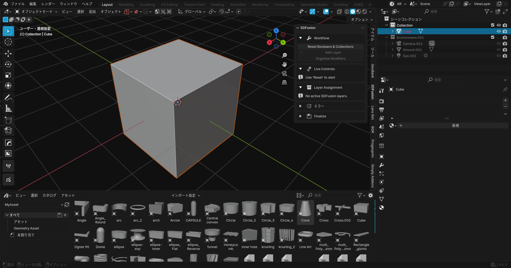

## Find SDFusion on N-panel.
Since it can get buried among various add-ons, finding it is the starting point.
 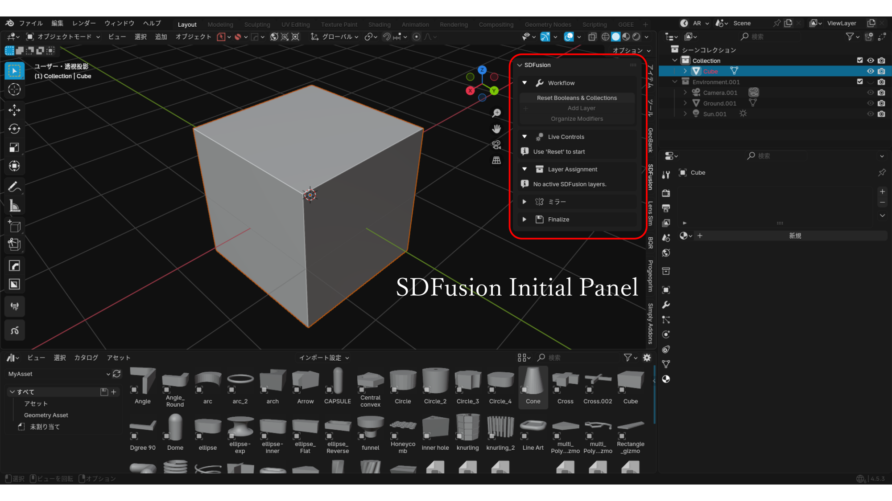

## Select the object, then click Reset Booleans & Collections.
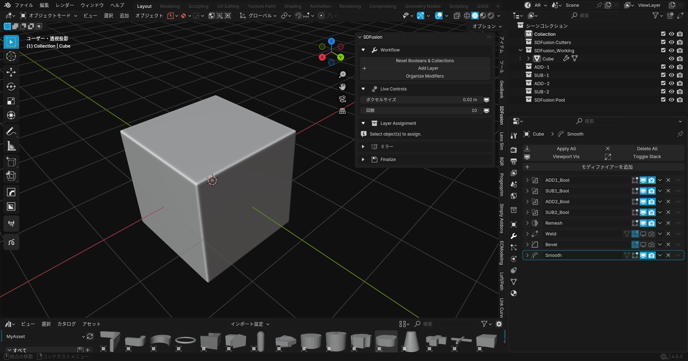

- Outliner: Several collections added
    - SDFusion Cutters: Storage for Boolean processing objects
    - SDFusion_Working: Storage for objects currently being worked on
    - ADD-x: Storage for objects used for addition
    - SUB-x: Storage for objects used for subtraction
    - SDFusion Pool: Storage for temporarily removing objects from processing

- Properties: Several modifiers are stacked
    - Boolean
    - Remesh
    - weld
    - Bevel
    - Smooth

This add-on primarily uses a workflow based on stacking existing modifiers.

## Trying to Make a Hole in the Cube Adding Objects and Boolean Subtraction
1. Add a cylinder: I have only added items so far and have not performed any other operations.
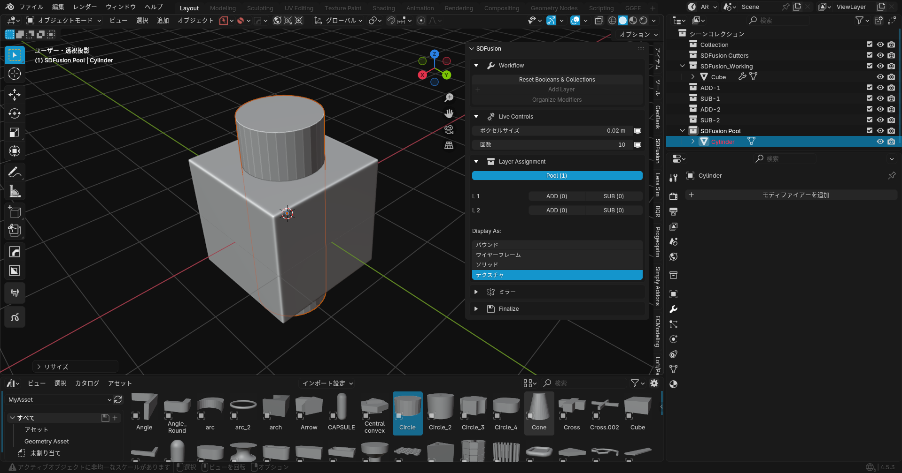

2. Change the Sub button click and display to a wireframe.
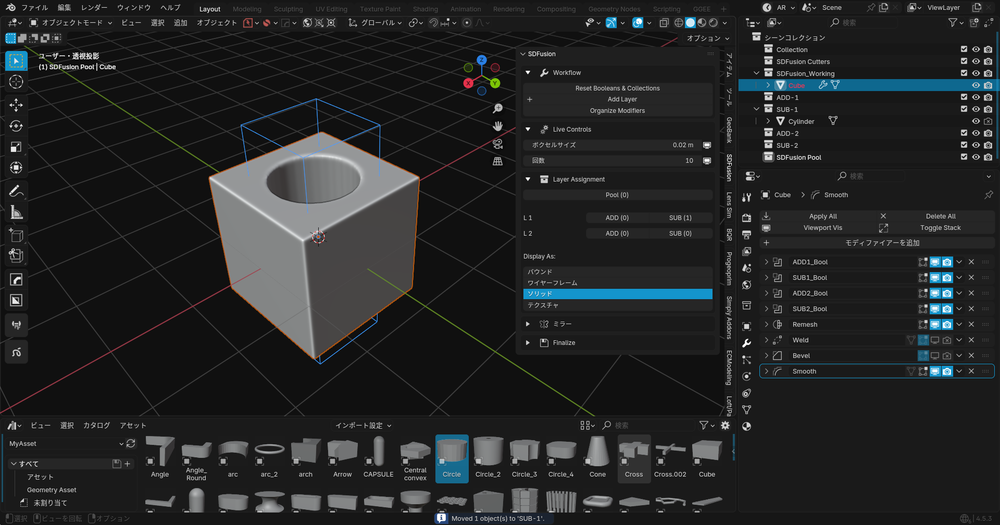
At this stage, nothing is finalized, so moving the cylindrical wireframe will shift the hole's position.
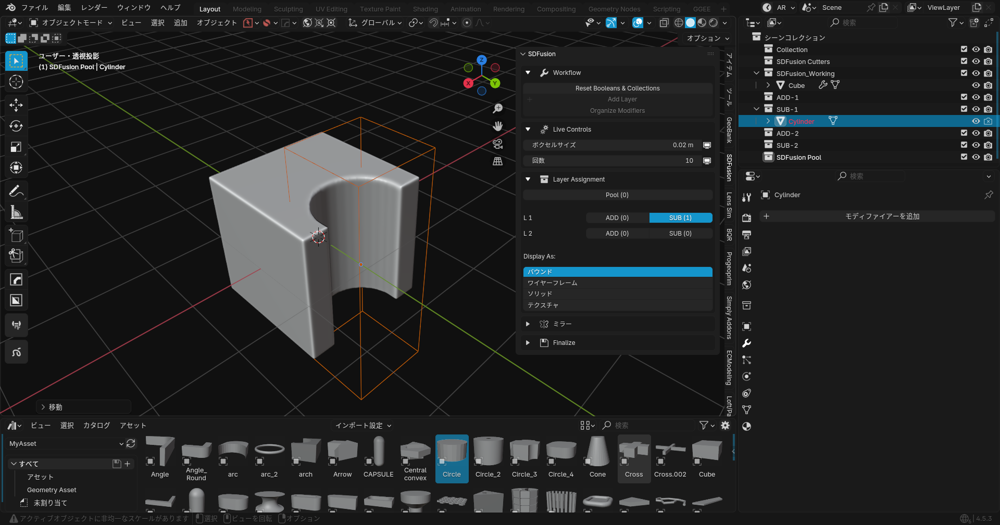

3. Let's add a small cube.: 
    - Add a cube
    - Adjust position and scale
    - Click the Add button in the N-Panel
    - Change the display to wireframe

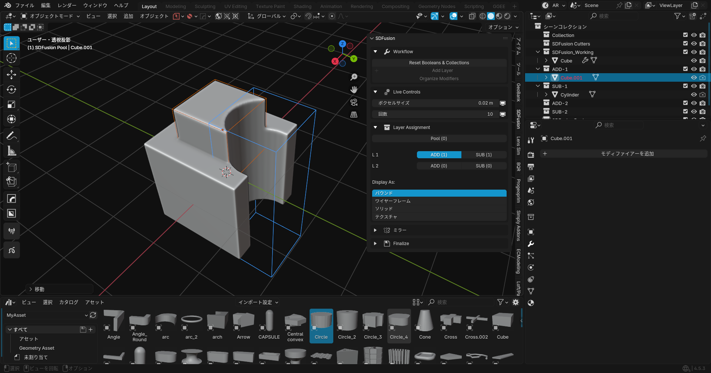
4. Let's change the cube layer from ADD-1 to ADD-2.
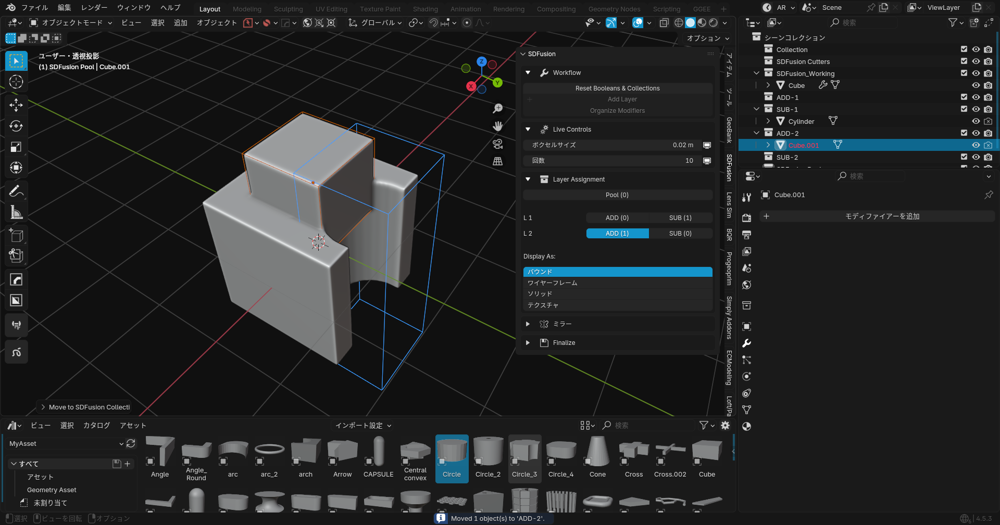Thus, this add-on aims to display the stack of Boolean modifiers as layers, making it easier to process additions and subtractions hierarchically.  
5. Alright, let's make some visual adjustments.
### Adjusting Voxel Remesh Size and Smoothing.
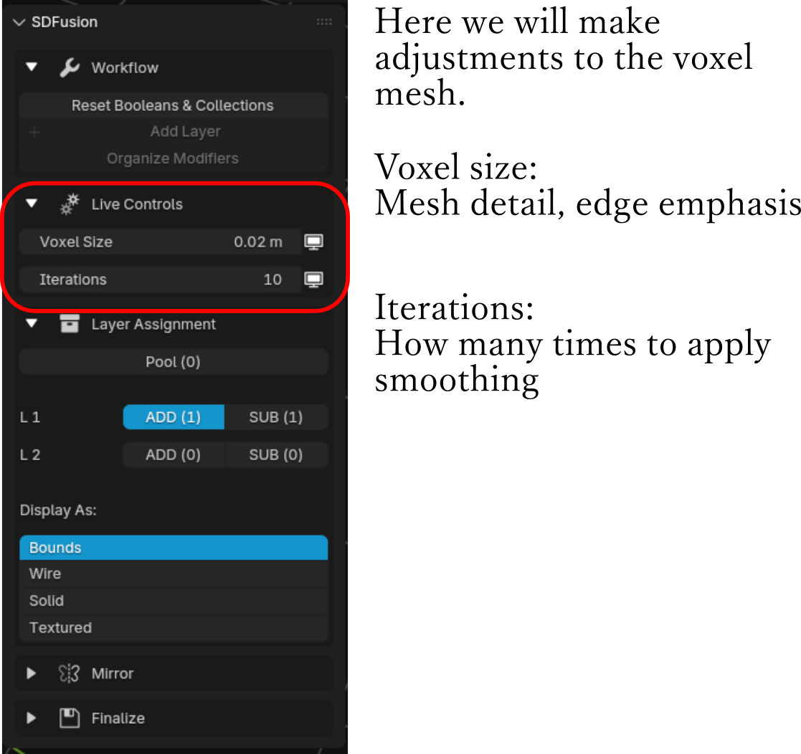 
6. Next,Let's open the Finalize tab. 
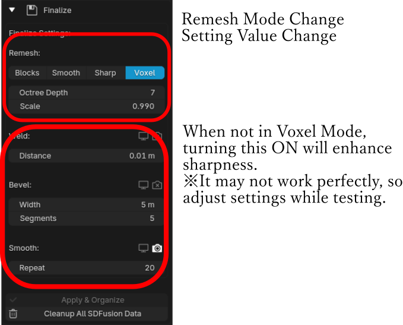
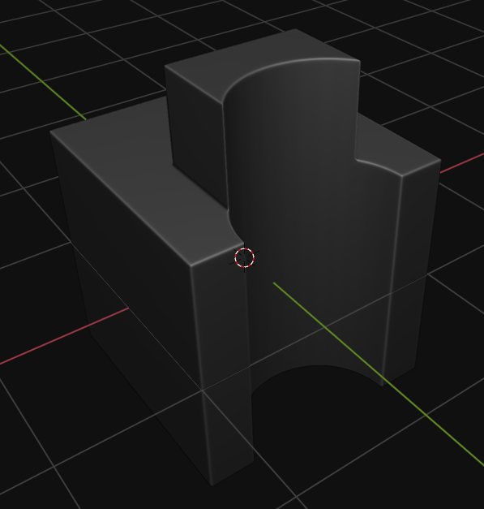 
7. Other Features.

- Add Layer: Add a Boolean hierarchy. It is designed to add ADD and SUB as a pair. 
Here's what it looks like after pressing once. You can see that ADD and SUB have been added both within the panel and in the outliner.
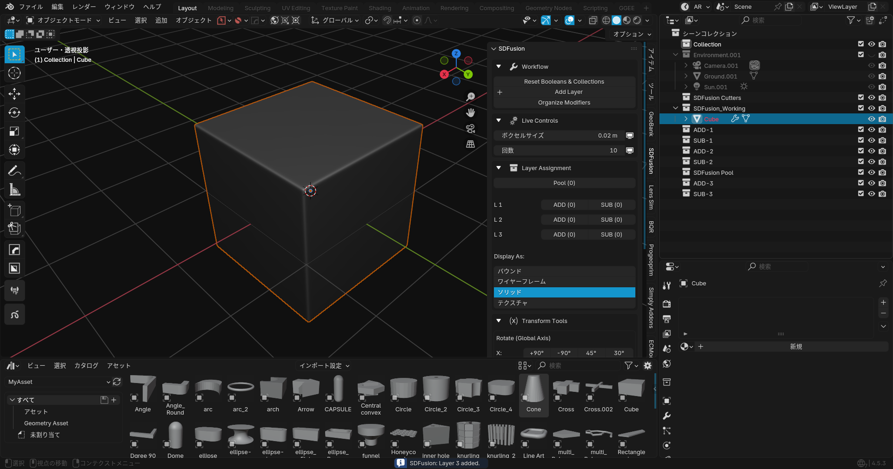 
This enables modeling using even deeper layers. 
- Location and Rotation Management.
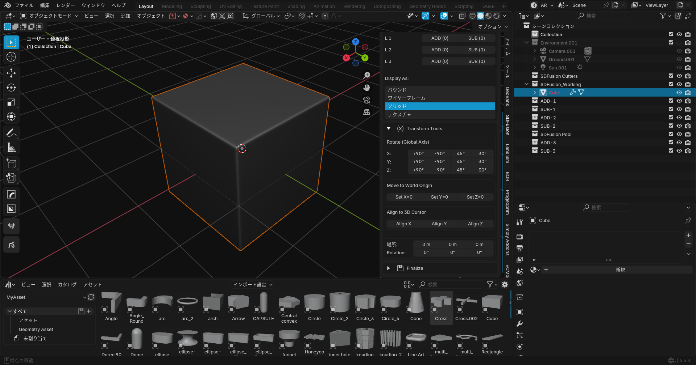 
We've temporarily discontinued the Mirror Modifier settings and instead incorporated them into the Transform-related options. We believe this will allow for more intuitive adjustments to rotation and movement.

Next : [Install](installation.md)