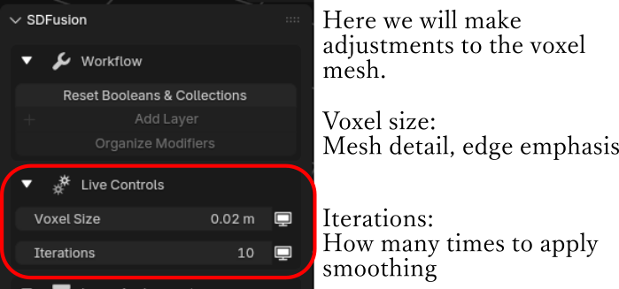

# How to Use

We will introduce the basic flow and the role and function of each button.

## Recommended Panel Layout

My personal favorite panel layouts for working with SDFusion:

- 3D Viewport
- Outliner
- Properties
- Asset Browser

---

## Find SDFusion on N-panel

The SDFusion panel is located in the 3D Viewport sidebar. Press **N** to toggle the sidebar, then find the **SDFusion** tab.

Since it can get buried among various add-ons, finding it is the starting point.

---

## Getting Started: Reset Booleans & Collections

1. Select a mesh object
2. Click **"Reset Booleans & Collections"** in the Workflow section

This creates:

**Collections in Outliner:**
- **SDFusion Cutters**: Storage for Boolean processing objects
- **SDFusion_Working**: Storage for objects currently being worked on
- **ADD-x**: Storage for objects used for addition (Union)
- **SUB-x**: Storage for objects used for subtraction (Difference)
- **SDFusion Pool**: Storage for temporarily removing objects from processing

**Modifiers in Properties:**
- Boolean modifiers for each layer
- **GeoRemesh** (geometry node-based) for smoothing and remeshing

This add-on primarily uses a workflow based on stacking existing modifiers.

---

## Tutorial: Making a Hole in a Cube

### Step 1: Add a Cylinder
Add a cylinder. At this point, it's just placed in the scene.

### Step 2: Assign to SUB Layer
1. Select the cylinder
2. Click the **SUB** button in Layer Assignment
3. The cylinder will display as wireframe

At this stage, nothing is finalized. Moving the cylindrical wireframe will shift the hole's position in real-time.

### Step 3: Add Another Shape
1. Add a cube
2. Adjust position and scale
3. Click **ADD** button in the N-Panel
4. The display changes to wireframe

### Step 4: Using Multiple Layers
You can change layer assignments to control the order of operations.

This add-on aims to display the stack of Boolean modifiers as layers, making it easier to process additions and subtractions hierarchically.

---

## Adjusting with Live Controls

The **Live Controls** section lets you adjust the GeoRemesh parameters in real-time:

- **Mesh Density**: Controls the resolution of the remeshed result. Higher = more detail.
- **Smoothing**: Amount of smoothing applied to the mesh. Higher = smoother.
- **Sharp**: Controls the sharpness of edges. Higher = crisper edges.
- **Edge Angle Parameter**: Threshold angle for edge detection.

> **Tip**: Start with lower Mesh Density for faster preview, then increase when finalizing.

---

## Finalize Tab

Open the Finalize tab when you're ready to complete your model.

- **Apply All**: Applies all modifiers and generates the final mesh
- **Cleanup All**: Removes temporary collections and objects

---

## Other Features

### Add Layer
Add more Boolean hierarchy levels. Pressing once adds a new ADD and SUB pair.

This enables modeling using even deeper layers for complex details.

### Transform Tools

**Rotation** (Global Axis):
- Quick rotate buttons: +90°, -90°, 45°, 30° for X/Y/Z axes

**Position**:
- **Move to World Origin**: Set X, Y, or Z to 0
- **Align to 3D Cursor**: Match X, Y, or Z to cursor position

**Display Options**:
- **Display Type**: Switch between Solid/Wireframe/Bounds
- **Overlay Wireframe**: Toggle wireframe overlay on/off

**Location & Rotation**: Direct input fields for precise adjustments.

> **Note**: We've discontinued the Mirror Modifier settings and incorporated them into Transform-related options for more intuitive adjustments.

---

## Useful Companion Add-ons

For add-ons that work well together with SDFusion, please also refer to [Other](other.md).

---

Next : [Gallery](gallery.md)

---

# Video Tutorials

## Sample Movie: Video showing the general flow

<iframe width="560" height="315" src="https://www.youtube.com/embed/ZIwjDKKdhYc" title="YouTube video player" frameborder="0" allow="accelerometer; autoplay; clipboard-write; encrypted-media; gyroscope; picture-in-picture; web-share" referrerpolicy="strict-origin-when-cross-origin" allowfullscreen></iframe>
