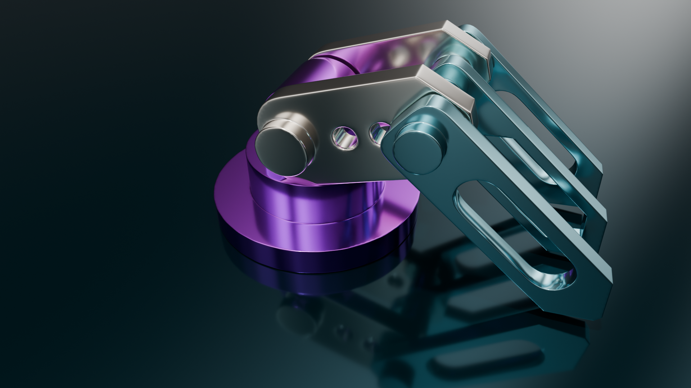
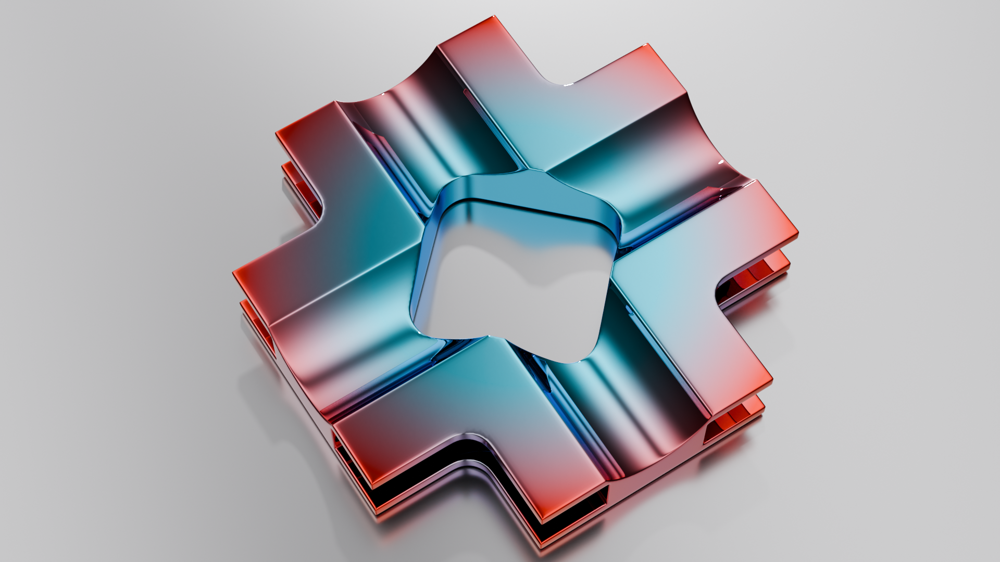

# SDFusion : Non-Destructive Boolean Modeling Toolkit

Product Pages : [SuperhiveMarket](https://superhivemarket.com/products/sdfusion/?ref=1435)

## About SDFusion.
**SDFusion** is an add-on that easily achieves non-destructive Boolean operations like SDF (Signed Distance Field) in Blender. It streamlines complex modeling with layer management and also supports mirroring and asset integration.

## Why SDFusion?
- **Layer-based workflow**: Stack Booleans with ADD/SUB layers for non-destructive adjustments.
- **Live controls**: Adjust Voxel Size and Smooth in real time.
- **Finalize feature**: Generate final meshes with batch application and cleanup.
- Compatible with Blender 4.5+

## Sample Images: This add-on makes it easy to create things like this.
 
 

 
 Next : [Install](installation.md) ,  Other [How to Use](how_to_use.md) , [Gallery](gallery.md)