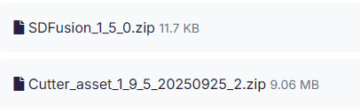
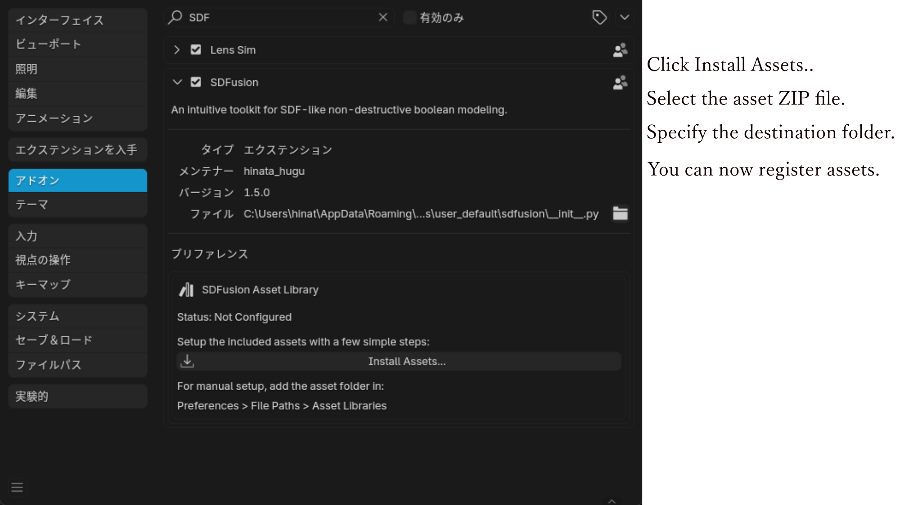
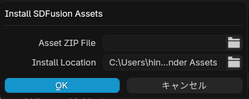
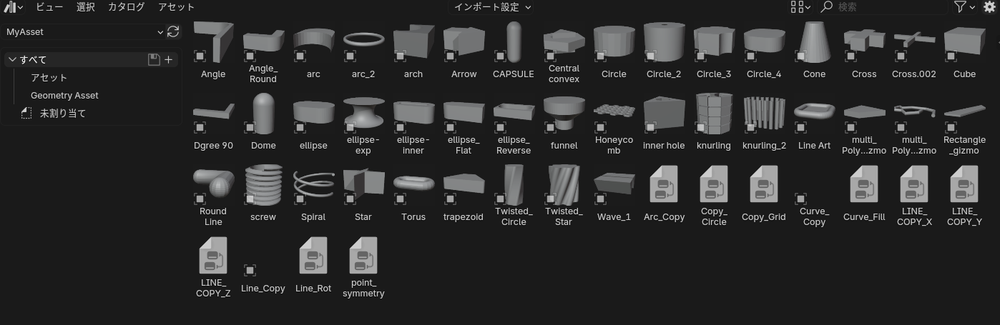

# How to Install.

## Supported Blender versions.
- Blender 4.5+
- The rest is unconfirmed. Since it's based on basic modifiers, it might work.
Other aspects remain unconfirmed. Since it's a basic modifier-based system, it might work.

## Installation Procedure.
1. Download the SDFusion add-on core and asset ZIP files from Superhive Market or other sources.
  
 The main add-on file and assets for Cutter should each be available for download as ZIP files. The numbers in the filenames indicate the version, so they may differ from those shown in this image.  
2. Install as a Blender add-on: Select the ZIP file via Edit > Preferences > Add-ons > Install....

### Installing Asset Files.
1. With SDFusion installed, check Preferences > Add-ons > SDFusion.

    - Asset Zip : ex.) Cutter_asset_1_9_5_20250925_2.zip
    - Install Locaton : Any folder for storing assets.

2. Check in Blender's Asset Browser

 Next : [How to Use](how_to_use.md)